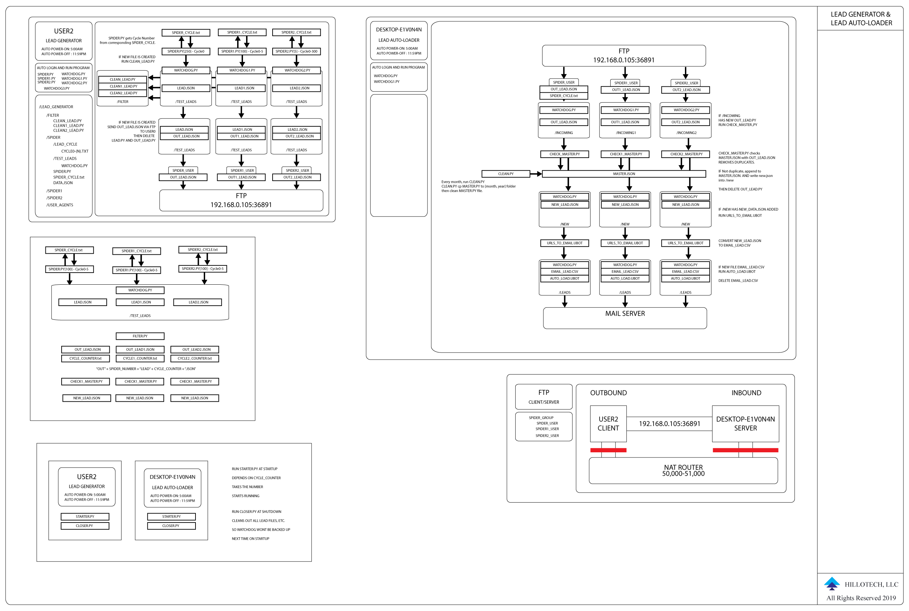

# Craglist Scrapper

This is my Craigslist Lead Generator.

It is made up of specific parts.

- Craiglist Scraper

Rotating IP Addresses and User Agents to spoof Craiglist. 
The URLS are organized based on traffic.

- Filters

First, filter leads based on keywords. Then filter based on duplicates.

-  URLS to EMAIL conversion

Currently using Ubot Studio to get EMAILS from the URLS. 
Need something that will click the button, because without it the 

 with the emails won't show. 
Sever-side Javascript?

- EMAIL campaign load and send

With Mail for Good automailer and AWS SES, we can send the emails.

## Basic Overview

CL Scrapper > data.json(titles,lead urls) > Filter > Conversion to Emails(Keep titles, and desciption for reference) > Email campaign load and sender 

## Infastructure Needs

We need to setup 